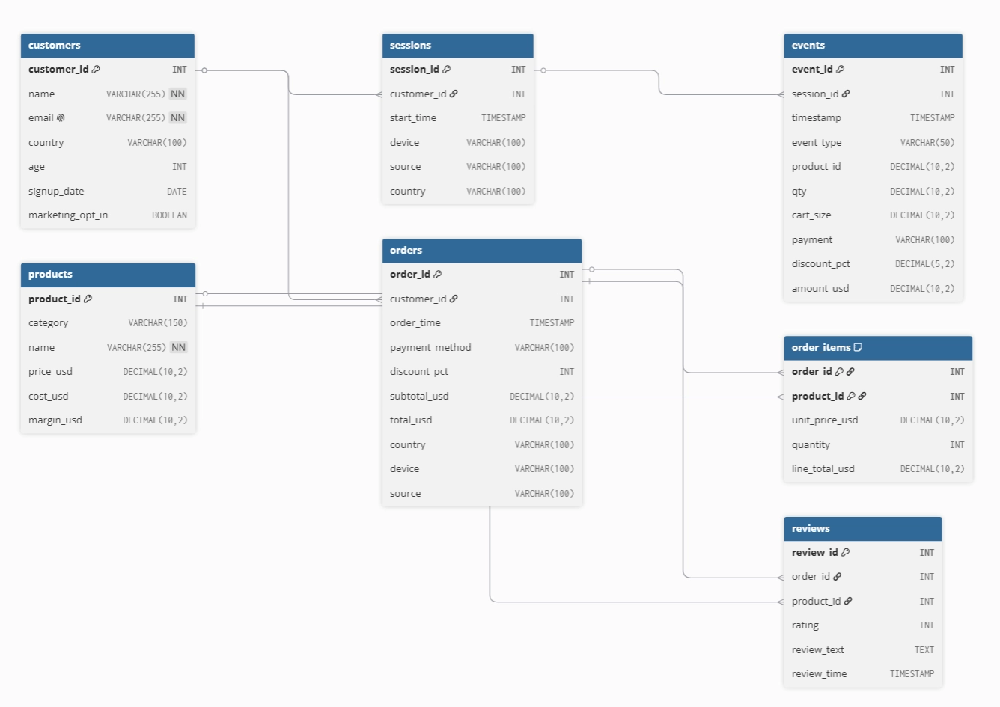

# Online Retail Clickstream Analysis

가상 온라인 리테일 클릭스트림 데이터를 활용해 고객 행동과 전환 패턴을 분석하는 프로젝트입니다.

이 프로젝트는 Kaggle의 synthetic online retail clickstream dataset을 바탕으로 온라인 쇼핑 행동, 구매 퍼널, 전환 행동 피처 설계, 테이블 조인 구조를 검증합니다. 데이터가 실제 서비스 로그가 아닌 합성 데이터이므로, 분석 결과를 실제 비즈니스 인사이트로 단정하기보다 클릭스트림 기반 퍼널 분석 방법론과 재현 가능한 분석 파이프라인을 점검하는 데 목적을 둡니다.

---

## 분석 목표

- 고객의 세션, 이벤트, 주문 데이터를 연결해 구매 전환 흐름을 복원합니다.
- 클릭스트림 이벤트에서 퍼널 단계별 이탈과 전환 패턴을 분석합니다.
- 주문, 주문 상세, 상품 테이블을 조인해 구매 상품 정보를 복원합니다.
- 전환 행동을 설명할 수 있는 세션/고객 단위 피처를 설계합니다.
- 합성 데이터 환경에서 재현 가능한 분석 파이프라인을 구성합니다.

---

## 데이터셋

Source:

- Kaggle: `wafaaelhusseini/e-commerce-transactions-clickstream`

범위:

| 항목 | 값 |
|------|----|
| 수집 기간 | `2020-01-01` ~ `2025-10-31` |
| 전체 고객 수 | 20,000명 |
| US 고객 수 | 3,648명 |
| 전체 이벤트 수 | 760,958건 |
| US 이벤트 수 | 138,891건 |
| 전체 주문 수 | 33,580건 |
| US 주문 수 | 6,138건 |

원본 데이터는 `data/raw/`에 두고, 중간 처리 결과는 `data/interim/`, 분석 또는 모델 입력용 최종 데이터는 `data/processed/`에 저장합니다. 원본 데이터 파일은 Git으로 추적하지 않습니다.

---

## 데이터 다운로드

### 방법 1 — Kaggle API

```bash
pip install kaggle
kaggle datasets download -d wafaaelhusseini/e-commerce-transactions-clickstream -p data/raw/ --unzip
```

> `~/.kaggle/kaggle.json`에 API 토큰이 설정되어 있어야 합니다.  
> [kaggle.com/settings](https://www.kaggle.com/settings) → Account → API → Create New Token

---

## 주요 테이블

분석에 사용하는 주요 테이블은 다음 7개입니다.

| 테이블 | 설명 |
|--------|------|
| `customers` | 고객 프로필 |
| `products` | 상품 정보 |
| `sessions` | 세션 메타데이터 |
| `events` | 클릭스트림 행동 로그 |
| `orders` | 주문 정보 |
| `order_items` | 주문 상세 상품 정보 |
| `reviews` | 상품 리뷰 |

### ERD (Entity-Relationship Diagram)



---

## 프로젝트 구조

```text
online-retail-clickstream-analysis/
├── README.md                     # 프로젝트 설명과 사용 방법
├── CHANGELOG.md                  # 변경 이력
├── CLAUDE.md                     # Claude Code용 프로젝트 지침
├── pyproject.toml                # 패키지 메타데이터와 도구 설정
├── uv.lock                       # uv 잠금 파일
├── requirements.txt              # 핵심 의존성 목록
│
├── configs/
│   ├── base.yaml                 # 공통 설정
│   ├── dev.yaml                  # 개발 환경 설정
│   └── prod.yaml                 # 제출/운영 환경 설정
│
├── data/
│   ├── raw/                      # 원본 데이터, git 추적 제외
│   ├── interim/                  # 중간 처리 데이터
│   └── processed/                # 분석/모델 입력용 최종 데이터
│
├── notebooks/                    # 탐색 분석과 실험 노트북
├── reports/                      # 보고서, 그림, 표, 대시보드 산출물
│
├── src/
│   ├── features/                 # 피처 생성 코드
│   ├── modeling/                 # 모델 학습 코드
│   ├── evaluation/               # 평가 지표와 검증 코드
│   └── visualization/            # 시각화 코드
│
└── tests/                        # 단위 테스트
```

---

## 개발 환경

이 프로젝트는 Python 3.11 이상과 `uv` 기반 의존성 관리를 사용합니다.

```bash
uv sync --extra dev
uv run pytest tests/ -v
```

`pip` 환경에서는 아래처럼 실행할 수 있습니다.

```bash
python -m venv .venv
source .venv/bin/activate
pip install -e ".[dev]"
pytest tests/ -v
```

Windows PowerShell에서는 가상환경을 다음처럼 활성화합니다.

```powershell
.venv\Scripts\Activate.ps1
```

커밋 전 lint/format이 자동으로 돌도록 pre-commit 훅을 설치합니다 (최초 1회).

```bash
uv run pre-commit install
```

---

## 환경 변수

`src/persona/`(페르소나 생성·라벨링) 스크립트는 Upstage API를 호출하므로 `.env` 설정이 필요합니다. 그 외 파이프라인(ALS, segment 등)은 `.env` 없이 동작합니다.

```bash
cp .env.example .env
```

`.env`에 아래 값을 채웁니다.

| 변수 | 설명 |
|------|------|
| `UPSTAGE_API_KEY` | [console.upstage.ai](https://console.upstage.ai)에서 발급. `src/persona/generation.py`, `src/persona/labeling.py`에서 사용 |

> `configs/` 아래 yaml 파일(`base.yaml`, `dev.yaml`, `prod.yaml`, `persona/*.yaml`, `segment/params.yaml`)은 전부 상대경로·공유 파라미터라 로컬에서 따로 수정할 값은 없습니다.

---

## 품질 확인

커밋하거나 PR을 열기 전에 아래 명령을 실행합니다.

```bash
uv run --extra dev ruff check src/ tests/
uv run --extra dev ruff format --check src/ tests/
uv run --extra dev pytest tests/ -v
```

---

## 변경 이력

변경 이력은 별도 [`CHANGELOG.md`](CHANGELOG.md) 파일로 관리합니다.
